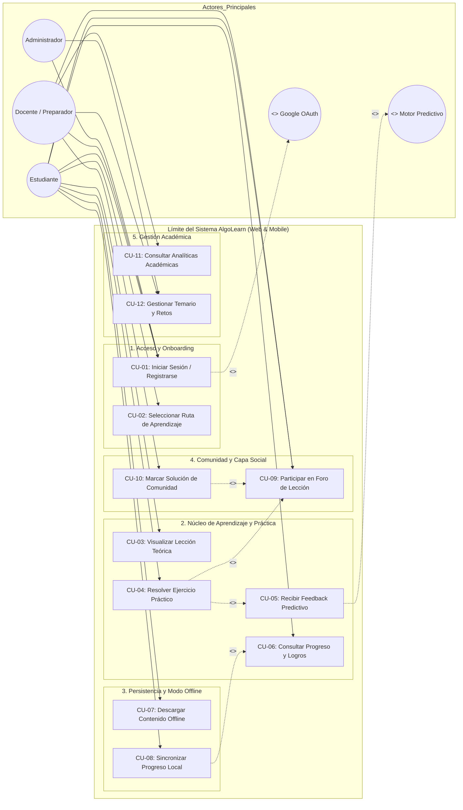
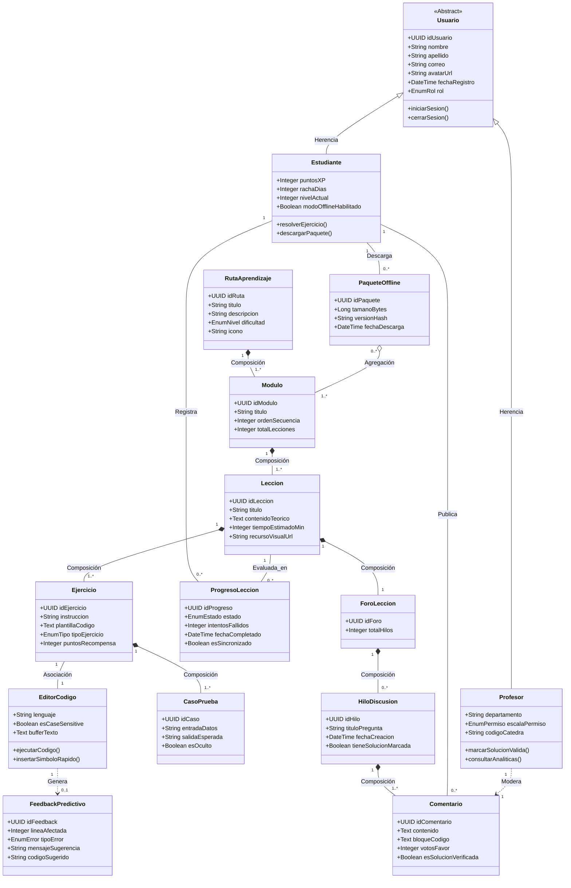

# Universidad Central de Venezuela
### Facultad de Ciencias — Escuela de Computación
### Tópicos Avanzados en Interacción Humano-Computador (6215)
### Semestre: I-2026

---

# LABORATORIO 3: Idear y Analizar
## Modelo de Casos de Uso y Modelo de Objetos del Dominio (MOD)

**Proyecto:** AlgoLearn — Gamificación del Pensamiento Computacional  
**Grupo #4:**
- Jonathan Torres
- Samuel Flores
- Ricardo Riera
- Diego Perdomo

**Docentes:**
- **Profesora:** Keyla Rivas
- **Preparadora:** Alejandra Giannattasio

---

## 1. Introducción y Marco de Trabajo

En el marco del método de desarrollo ágil **PDCC-IHC** (*Proceso de Diseño Centrado en el Usuario - IHC*) y tras consolidar la **Fase de Empatía** y la **Fase de Definición** (Laboratorios 1 y 2), este documento aborda la etapa de **Idear y Analizar**.

A partir de los hallazgos de usabilidad sobre la competencia (SoloLearn, Fragata) y los requerimientos funcionales aprobados, formalizamos el comportamiento del sistema AlgoLearn mediante:
1. **El Modelo de Casos de Uso (DCU):** Identificación de actores, límites del sistema, paquetes funcionales y especificaciones textuales rigurosas de los flujos de interacción (Actor-Sistema), contemplando casos de error, retroalimentación <100ms y persistencia offline.
2. **El Modelo de Objetos del Dominio (MOD):** Representación conceptual de las entidades de la plataforma, sus atributos estructurales, cardinalidades y relaciones semánticas (Asociación, Agregación, Composición, Asociación Ternaria y Herencia).

---

## 2. Matriz de Trazabilidad: Requerimientos Funcionales a Casos de Uso

| ID Requerimiento | Descripción Sintética | Plataforma | Caso(s) de Uso Asociado(s) |
| :--- | :--- | :--- | :--- |
| **RF-01** | Registro y autenticación local o federada (Google) sin bloqueos | Web / Mobile | `CU-01: Iniciar Sesión / Registrarse` |
| **RF-02** | Selección de ruta y catálogo abierto sin jerarquías rígidas | Web / Mobile | `CU-02: Seleccionar Ruta de Aprendizaje` |
| **RF-03** | Microlearning con visualización sintáctica y diagramas de flujo | Web / Mobile | `CU-03: Visualizar Lección Teórica` |
| **RF-04 / RF-WEB-01** | Editor de código interactivo case-sensitive y atajos rápidos | Web / Mobile | `CU-04: Resolver Ejercicio Práctico` |
| **RF-05** | Retroalimentación predictiva en tiempo real (<100ms) ante errores sintácticos | Web / Mobile | `CU-05: Recibir Feedback Predictivo` |
| **RF-06** | Seguimiento persistente de progreso, rachas e insignias gamificadas | Web / Mobile | `CU-06: Consultar Progreso y Logros` |
| **RF-07 / RF-MOV-02** | Descarga local de módulos y sincronización bidireccional offline | Mobile | `CU-07: Descargar Contenido Offline`<br>`CU-08: Sincronizar Progreso Local` |
| **RF-08** | Capa social comunitaria y foros de discusión por lección específica | Web / Mobile | `CU-09: Participar en Foro de Lección`<br>`CU-10: Marcar Solución de Comunidad` |
| **RF-WEB-03** | Consola de analíticas y tasa de error para el cuerpo docente | Web | `CU-11: Consultar Analíticas Académicas`<br>`CU-12: Gestionar Temario y Retos` |
| **RF-MOV-03** | Integración ergonómica con el teclado nativo y franja de operadores | Mobile | `CU-04: Resolver Ejercicio Práctico` |

---

## 3. Diagrama de Casos de Uso (DCU)

### 3.1. Identificación de Actores
- **Estudiante (Actor Primario):** Estudiante de 1er y 2do semestre de Computación, Informática o Ingeniería que interactúa con las unidades de microlearning, resuelve ejercicios en el editor y participa en la comunidad.
- **Docente / Preparador (Actor Secundario):** Profesor o preparador de la UCV que audita el progreso de su cohorte, detecta cuellos de botella mediante métricas y modera respuestas destacadas en los foros.
- **Administrador de Plataforma (Actor de Soporte):** Encargado de la gestión de roles, integridad del catálogo y mantenimiento del sistema.
- **Motor Predictivo / Evaluador Sintáctico (Actor del Sistema):** Servicio backend especializado en analizar árboles de sintaxis abstracta (AST) del código del estudiante y diagnosticar errores específicos en menos de 100ms.
- **Servicio de Autenticación OAuth (Actor Externo):** Proveedor de identidad externo (Google Identity Services).

### 3.2. Representación Visual del DCU (Mermaid)



---

## 4. Especificaciones Detalladas de Casos de Uso

Se presentan a continuación las especificaciones completas de los casos de uso más representativos y críticos para la experiencia de usuario y arquitectura de AlgoLearn, siguiendo el formato estándar de la Escuela de Computación (UCV).

---

### Caso de Uso CU-01: Iniciar Sesión / Registrarse

| Campo | Descripción |
| :--- | :--- |
| **Identificador** | `CU-01` |
| **Nombre** | Iniciar Sesión / Registrarse |
| **Actores** | Estudiante, Docente, Proveedor Google OAuth |
| **Propósito** | Permitir a los usuarios ingresar a AlgoLearn de forma directa mediante credenciales locales o federadas, garantizando un onboarding sin bloqueos burocráticos. |
| **Precondición** | La aplicación (Web o Móvil) está iniciada y con acceso a la pantalla de bienvenida. |
| **Postcondición** | El usuario queda autenticado en la sesión activa y redirigido al árbol de lecciones o selección de ruta. |

#### Flujo Básico de Eventos:
1. El usuario selecciona la opción "Continuar con Google" o ingresa su correo y contraseña.
2. El sistema valida el formato de los datos o redirige al flujo de autenticación federada OAuth.
3. El proveedor externo o la base de datos confirma las credenciales.
4. El sistema verifica si el perfil cuenta con Nombre y Apellido completos.
5. El sistema emite el token de sesión seguro, actualiza la fecha de último acceso y redirige a la vista principal de cursos (`CU-02`).

#### Flujos Alternos:
- **FA-01 (Perfil OAuth incompleto):** Si la cuenta de Google no expone el nombre completo, el sistema muestra una única vista simplificada solicitando el nombre visible del estudiante, sin bloquear el registro ni exigir datos superfluos de facultad/universidad.
- **FA-02 (Usuario ya registrado):** Si el correo ya existe al intentar registrarse, el sistema sugiere amistosamente iniciar sesión conservando el identificador para evitar reprocesos.

#### Flujos de Excepción:
- **FE-01 (Fallo de conexión o red intermitente):** El sistema muestra un mensaje no intrusivo: *"No pudimos conectar con el servidor. Si ya habías iniciado sesión en este dispositivo, puedes continuar en Modo Offline"* permitiendo el acceso a contenidos descargados.
- **FE-02 (Credenciales inválidas):** La interfaz resalta en color de alerta el campo erróneo y despliega: *"Correo o contraseña incorrectos. Verifica tus datos o restablece tu clave"*, manteniendo el correo en pantalla.

---

### Caso de Uso CU-04: Resolver Ejercicio Práctico en Editor

| Campo | Descripción |
| :--- | :--- |
| **Identificador** | `CU-04` |
| **Nombre** | Resolver Ejercicio Práctico en Editor de Código |
| **Actores** | Estudiante, Motor Predictivo (Sistema) |
| **Propósito** | Proveer al estudiante un entorno interactivo y ergonómico para escribir algoritmos, manipular bloques o rellenar código sensible a mayúsculas/minúsculas, recibiendo validación continua. |
| **Precondición** | El estudiante ha seleccionado un ejercicio desbloqueado dentro de una lección. |
| **Postcondición** | El ejercicio queda registrado como "Completado", sumando puntos de experiencia (XP) y actualizando la racha diaria. |

#### Flujo Básico de Eventos:
1. El sistema presenta el enunciado didáctico del ejercicio, el código base o plantilla, y los botones de acción rápida.
2. En dispositivos móviles, el sistema despliega el teclado nativo del sistema operativo complementado con una barra superior de caracteres especiales de programación (`{`, `}`, `(`, `)`, `;`, `=`, `<`, `>`).
3. El estudiante escribe o edita la solución algorítmica requerida.
4. El estudiante pulsa el botón principal "Comprobar Solución".
5. El sistema ejecuta el caso de uso `CU-05: Recibir Feedback Predictivo` de forma inmediata (<100ms).
6. El código pasa satisfactoriamente las pruebas unitarias del ejercicio.
7. La interfaz emite un refuerzo visual positivo (sonido sutil opcional, confeti ligero, animación de éxito), acredita +25 XP, actualiza el progreso y habilita el botón "Siguiente Lección".

#### Flujos Alternos:
- **FA-01 (Solución alternativa válida):** Si el estudiante resuelve el problema usando una estructura algorítmica válida diferente a la plantilla modelo, el motor valida el resultado por salida esperada y premia con una bonificación por creatividad.
- **FA-02 (Consulta de dudas en comunidad):** Si el estudiante desea ver qué opinan sus compañeros antes de enviar, pulsa el botón flotante "Discutir", abriendo el modal de `CU-09` sin perder el código escrito en el editor.

#### Flujos de Excepción:
- **FE-01 (Error de Sintaxis o Lógica):** Se activa el flujo de excepción de `CU-05`, resaltando la línea específica del fallo y ofreciendo una pista contextual sin dar la respuesta cruda.

---

### Caso de Uso CU-05: Recibir Feedback Predictivo Inteligente

| Campo | Descripción |
| :--- | :--- |
| **Identificador** | `CU-05` |
| **Nombre** | Recibir Feedback Predictivo Inteligente |
| **Actores** | Motor Predictivo (Sistema), Estudiante |
| **Propósito** | Diagnosticar de manera instantánea el origen exacto del error en el código del estudiante, proporcionando explicaciones constructivas en lenguaje natural sin frustración. |
| **Precondición** | `CU-04` invoca la verificación del código del estudiante. |
| **Postcondición** | La interfaz despliega la sugerencia precisa y resalta visualmente el foco del problema. |

#### Flujo Básico de Eventos:
1. El Motor Predictivo parsea el código fuente y genera el árbol de análisis sintáctico (AST).
2. Se evalúa la conformidad semántica contra las reglas del ejercicio (ej. nombres de variables, sensibilidad a mayúsculas/minúsculas, cierre de llaves, indentación).
3. Si se detecta una discrepancia (ejemplo: usar `Print` con mayúscula en lugar de `print`, u omitir dos puntos `:` en un condicional):
   - El sistema localiza la línea y columna exacta.
   - Genera un mensaje humanizado: *"Revisa la línea 3: 'Print' está en mayúscula. Recuerda que este lenguaje distingue entre mayúsculas y minúsculas"*.
4. La interfaz despliega un tooltip emergente no bloqueante junto a la línea señalada y mantiene el editor activo para corregir en un solo toque.

#### Flujos Alternos:
- **FA-01 (Segundo intento fallido):** Si el estudiante falla consecutivamente 2 veces, el sistema ofrece una pista escalonada: *"¿Deseas ver un ejemplo visual de cómo declarar esta estructura?"* sin forzar videos largos.

---

### Caso de Uso CU-07: Descargar Contenido para Modo Offline

| Campo | Descripción |
| :--- | :--- |
| **Identificador** | `CU-07` |
| **Nombre** | Descargar Contenido para Modo Offline |
| **Actores** | Estudiante (Mobile) |
| **Propósito** | Facilitar el almacenamiento local de lecciones teóricas, animaciones ligeras y ejercicios prácticos en la memoria del teléfono para estudiar sin conexión a internet (transporte público, contingencias eléctricas). |
| **Precondición** | Dispositivo móvil con conexión activa a internet y almacenamiento disponible (>20MB). |
| **Postcondición** | El paquete de lecciones queda marcado como "Disponible sin conexión". |

#### Flujo Básico de Eventos:
1. El estudiante navega a una unidad o tema (ej. "Estructuras Condicionales y Bucles").
2. El estudiante presiona el icono de descarga offline (flecha hacia abajo).
3. El sistema calcula el peso del paquete (optimizado en JSON/SVG vectorial ligero, <5MB por unidad).
4. El sistema descarga y almacena los datos en la base de datos local del dispositivo (IndexedDB / SQLite).
5. La interfaz actualiza el estado del módulo con una insignia verde indicando "Listo para usar sin internet".

---

### Caso de Uso CU-09: Participar en Foro de Discusión de la Lección

| Campo | Descripción |
| :--- | :--- |
| **Identificador** | `CU-09` |
| **Nombre** | Participar en Foro de Discusión de la Lección |
| **Actores** | Estudiante, Docente / Preparador |
| **Propósito** | Crear un espacio de apoyo asíncrono y contextualizado para cada ejercicio donde los alumnos aclaren dudas y compartan estrategias. |
| **Precondición** | El usuario se encuentra en la vista de una lección o ejercicio específico. |
| **Postcondición** | La consulta o respuesta queda indexada en el hilo correspondiente a esa lección. |

#### Flujo Básico de Eventos:
1. El usuario pulsa el botón "Discutir Lección".
2. El sistema abre un panel lateral (en Web) o un Bottom Sheet deslizable (en Mobile) con los hilos asociados estrictamente a esa lección.
3. El usuario puede leer respuestas votadas por la comunidad o redactar una nueva pregunta.
4. Si redacta un aporte, puede adjuntar un bloque de código con sintaxis coloreada mediante el botón "Insertar Código".
5. El sistema publica el comentario y notifica a los participantes del hilo.

---

## 5. Modelo de Objetos del Dominio (MOD)

### 5.1. Definición de Entidades y Objetos del Dominio

1. **`Usuario` (Superclase abstracta):**
   - *Atributos:* `idUsuario: UUID`, `nombre: String`, `apellido: String`, `correo: String`, `avatarUrl: String`, `fechaRegistro: DateTime`, `rol: EnumRol`.
   - *Responsabilidad:* Manejar la identidad y credenciales básicas en la plataforma.

2. **`Estudiante` (Especialización de Usuario):**
   - *Atributos:* `puntosXP: Integer`, `rachaDias: Integer`, `nivelActual: Integer`, `modoOfflineHabilitado: Boolean`.
   - *Responsabilidad:* Acumular progreso, resolver lecciones y gestionar contenidos descargados.

3. **`Profesor / Preparador` (Especialización de Usuario):**
   - *Atributos:* `departamento: String`, `escalaPermiso: EnumPermiso`, `codigoCatedra: String`.
   - *Responsabilidad:* Supervisar cohortes estudiantiles, validar soluciones en foros y crear retos algorítmicos.

4. **`RutaAprendizaje`:**
   - *Atributos:* `idRuta: UUID`, `titulo: String`, `descripcion: String`, `dificultad: EnumNivel`, `icono: String`.
   - *Responsabilidad:* Agrupar el árbol temático (ej. "Pensamiento Computacional", "Estructuras de Datos").

5. **`Modulo`:**
   - *Atributos:* `idModulo: UUID`, `titulo: String`, `ordenSecuencia: Integer`, `totalLecciones: Integer`.
   - *Responsabilidad:* Organizar unidades temáticas (ej. "Variables y Tipos", "Condicionales If/Else").

6. **`Leccion`:**
   - *Atributos:* `idLeccion: UUID`, `titulo: String`, `contenidoTeorico: MarkdownText`, `tiempoEstimadoMin: Integer`, `recursoVisualUrl: String`.
   - *Responsabilidad:* Impartir el concepto visual en microlearning antes de la práctica.

7. **`Ejercicio`:**
   - *Atributos:* `idEjercicio: UUID`, `instruccion: String`, `plantillaCodigo: Text`, `tipoEjercicio: EnumTipo`, `puntosRecompensa: Integer`.
   - *Responsabilidad:* Definir el reto interactivo que se resuelve en el editor.

8. **`CasoPrueba`:**
   - *Atributos:* `idCaso: UUID`, `entradaDatos: String`, `salidaEsperada: String`, `esOculto: Boolean`.
   - *Responsabilidad:* Validar automáticamente las soluciones sometidas en el editor.

9. **`EditorCodigo`:**
   - *Atributos:* `lenguaje: String`, `esCaseSensitive: Boolean`, `bufferTexto: Text`, `cursorPos: Integer`.
   - *Responsabilidad:* Gestionar el área de edición, detección de caracteres y comunicación con el teclado.

10. **`FeedbackPredictivo`:**
    - *Atributos:* `idFeedback: UUID`, `lineaAfectada: Integer`, `tipoError: EnumError`, `mensajeSugerencia: String`, `codigoSugerido: String`.
    - *Responsabilidad:* Diagnosticar el fallo de sintaxis y proponer la pista al usuario.

11. **`ProgresoLeccion`:**
    - *Atributos:* `idProgreso: UUID`, `estado: EnumEstado`, `intentosFallidos: Integer`, `fechaCompletado: DateTime`, `esSincronizado: Boolean`.
    - *Responsabilidad:* Almacenar el estado de resolución de cada estudiante.

12. **`PaqueteOffline`:**
    - *Atributos:* `idPaquete: UUID`, `tamanoBytes: Long`, `versionHash: String`, `fechaDescarga: DateTime`.
    - *Responsabilidad:* Encapsular lecciones y ejercicios para persistencia local en el dispositivo.

13. **`ForoLeccion`:**
    - *Atributos:* `idForo: UUID`, `totalHilos: Integer`.
    - *Responsabilidad:* Espacio comunitario exclusivo de cada lección.

14. **`HiloDiscusion`:**
    - *Atributos:* `idHilo: UUID`, `tituloPregunta: String`, `fechaCreacion: DateTime`, `tieneSolucionMarcada: Boolean`.
    - *Responsabilidad:* Tema de debate o consulta dentro del foro de una lección.

15. **`Comentario`:**
    - *Atributos:* `idComentario: UUID`, `contenido: Text`, `bloqueCodigo: Text`, `votosFavor: Integer`, `esSolucionVerificada: Boolean`.
    - *Responsabilidad:* Aporte específico de un usuario en un hilo de discusión.

---

### 5.2. Especificación de Relaciones y Cardinalidades

1. **Generalización / Herencia:**
   - `Usuario` $\leftarrow$ `Estudiante` (Flecha sólida dirigida al superobjeto `Usuario`).
   - `Usuario` $\leftarrow$ `Profesor` (Flecha sólida dirigida al superobjeto `Usuario`).

2. **Composición (Relación Todo-Parte Inseparable, Rombo Relleno):**
   - `RutaAprendizaje` **(1)** $\blacklozenge$--- **(1..*)** `Modulo`
   - `Modulo` **(1)** $\blacklozenge$--- **(1..*)** `Leccion`
   - `Leccion` **(1)** $\blacklozenge$--- **(1..*)** `Ejercicio`
   - `Ejercicio` **(1)** $\blacklozenge$--- **(1..*)** `CasoPrueba`
   - `Leccion` **(1)** $\blacklozenge$--- **(1)** `ForoLeccion`
   - `ForoLeccion` **(1)** $\blacklozenge$--- **(0..*)** `HiloDiscusion`
   - `HiloDiscusion` **(1)** $\blacklozenge$--- **(1..*)** `Comentario`

3. **Agregación (Relación Todo-Parte Separable, Rombo Vacío):**
   - `PaqueteOffline` **(0..*)** $\lozenge$--- **(1..*)** `Modulo` *(Un paquete offline agrupa módulos para guardarse localmente, pero los módulos existen independientemente del paquete).*

4. **Asociación Simple:**
   - `Estudiante` **(1)** --- **(0..*)** `ProgresoLeccion`
   - `Leccion` **(1)** --- **(0..*)** `ProgresoLeccion`
   - `Estudiante` **(1)** --- **(0..*)** `Comentario`
   - `Ejercicio` **(1)** --- **(1)** `EditorCodigo`
   - `EditorCodigo` **(1)** --- **(0..1)** `FeedbackPredictivo`

5. **Asociación Ternaria:**
   - **`ValidacionSolucion`:** Relaciona `Estudiante`, `Ejercicio` y `FeedbackPredictivo`, registrando el intento del estudiante, el ejercicio evaluado y el diagnóstico emitido por el sistema.

```
       [Estudiante]
            1
            |
            |
    [ValidacionSolucion] ----- 1 [FeedbackPredictivo]
            |
            |
            1
       [Ejercicio]
```

---

### 5.3. Representación Visual del MOD (Mermaid Class Diagram)



---

## 6. Archivo Editable Draw.io

Para dar estricto cumplimiento a la pauta de entrega del Laboratorio 3, se generó el archivo estructurado **[`diagramas_lab3.drawio`](diagramas_lab3.drawio)** en esta misma carpeta, el cual contiene:
1. **Página 1:** Diagrama de Casos de Uso (DCU) con paquetes, actores y estereotipos `<<include>>` / `<<extend>>`.
2. **Página 2:** Modelo de Objetos del Dominio (MOD) con notación formal UML (rombos de composición rellenos, rombos de agregación vacíos, herencias sólidas y cardinalidades).

---
*Documento elaborado para TAIHC 6215 - UCV Semestre I-2026 por el Grupo #4.*
