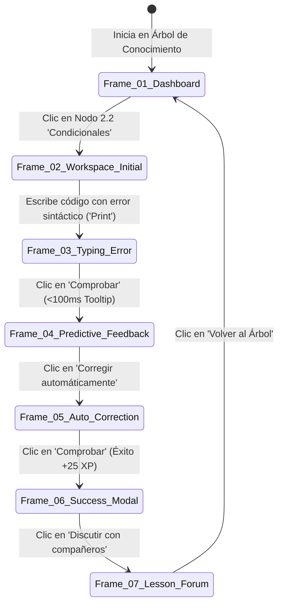

# Universidad Central de Venezuela
### Facultad de Ciencias — Escuela de Computación
### Tópicos Avanzados en Interacción Humano-Computador (6215)
### Semestre: I-2026

---

# LABORATORIO 7: Prototipaje
## Prototipo Vertical de Alta Fidelidad y Comparativa entre Figma y Uizard

**Proyecto:** AlgoLearn — Gamificación del Pensamiento Computacional  
**Grupo #4:**
- Jonathan Torres
- Samuel Flores
- Ricardo Riera
- Diego Perdomo

**Docentes:**
- **Profesora:** Keyla Rivas
- **Preparadora:** Alejandra Giannattasio

---

## 1. Definición y Alcance del Prototipo Vertical

A diferencia del prototipo horizontal (Laboratorio 5), que explora la amplitud superficial de la plataforma, el **Prototipo Vertical** se enfoca en una funcionalidad nuclear de forma profunda, completa y navegable, acercándose al comportamiento real del producto final.

### Funcionalidad Clave Seleccionada:
> **"Flujo Integral de Resolución Práctica de un Reto Algorítmico con Asistencia Predictiva de Sintaxis, Ejecución de Código y Retroalimentación Inmediata en la Comunidad."**

Esta funcionalidad fue elegida por constituir la **propuesta de valor de usabilidad** y la mayor ventaja competitiva de AlgoLearn frente a las deficiencias detectadas en SoloLearn y Fragata (retroalimentación instantánea <100ms, editor ergonómico, prevención de errores sin frustración y foros por lección).

---

## 2. Especificación del Prototipo Vertical en Figma

El prototipo se diseñó en **Figma** aplicando con fidelidad milimétrica el sistema de diseño y la guía de estilos establecida en el Laboratorio 6 (colores semánticos, tipografías *Plus Jakarta Sans* y *JetBrains Mono*, contraste WCAG 2.1 AA/AAA).

### 2.1. Arquitectura de Frames y Navegabilidad End-to-End

El recorrido interactivo se compone de 6 estados secuenciales completamente enlazados:



#### Descripción de los Frames del Prototipo Figma:
1. **Frame 01 - Dashboard Gamificado (`Web Desktop: 1440x900 / Mobile: 390x844`):**  
   Muestra el árbol de habilidades con el módulo "Pensamiento Computacional", la racha de 5 días activa, 350 XP y el nodo 2.2 parpadeando con estado "En curso".
2. **Frame 02 - Workspace de Ejercicio (Estado Inicial):**  
   Presenta la teoría visual con un diagrama de flujo interactivo a la izquierda y el editor en modo terminal nocturna (`#0F172A`) con la plantilla inicial y la franja ergonómica de caracteres especiales (`{ } ( ) : = >`).
3. **Frame 03 - Workspace (Estado de Error del Estudiante):**  
   El estudiante escribe `Print(edad)` incurriendo en el error común de mayúsculas (case-sensitive) documentado en los tests con usuarios.
4. **Frame 04 - Asistente Predictivo Desplegado (<100ms):**  
   Al presionar "Comprobar", la línea 3 se resalta con un subrayado suave ámbar/rojo y emerge un tooltip interactivo: *"Atención didáctica: En Python y C, 'Print' con mayúscula no es reconocido. ¿Quisiste decir 'print'?"* junto al botón de corrección en 1 toque.
5. **Frame 05 - Corrección Aplicada y Ejecución Exitosa:**  
   El editor se actualiza a `print(edad)` y la consola de salida muestra `> 18` con los 3 casos de prueba en verde (`#16A34A`).
6. **Frame 06 - Modal de Recompensa y Refuerzo Positivo:**  
   Modal centrado con animación sutil de confeti, acreditación de `+25 XP`, incremento de racha a 6 días y botón primario *"Siguiente Lección"*.
7. **Frame 07 - Drawer Lateral del Foro de la Lección:**  
   Apertura suave desde la derecha mostrando el hilo *"¿Por qué 'print' debe ir en minúscula?"* con la respuesta oficial verificada por un preparador de la Escuela de Computación UCV.

### 2.2. Propiedades Técnicas Utilizadas en Figma
- **Auto Layout v5:** Todos los contenedores usan espaciado adaptativo (padding 8px/16px/24px), garantizando que el diseño web escale fluidamente a formatos tablet y móvil.
- **Componentes y Variantes:** Se crearon componentes maestros con variantes de estado (`Default`, `Hover`, `Active`, `Error`, `Disabled`, `Loading`).
- **Prototipado Interactivo:** Transiciones con curvas de animación *Smart Animate* (Ease-out 150ms), simulando retroalimentación instantánea y feedback cinético.

---

## 3. Generación con IA en Uizard (Autodesigner)

Para cumplir con el requerimiento del laboratorio, se formuló un prompt exhaustivo de ingeniería de prompts aprovechando el motor generativo **Autodesigner 2.0** de Uizard.

### 3.1. Prompt Estructurado Suministrado a Uizard

```text
Project Name: AlgoLearn - Gamified Computer Science Education Platform
Target Audience: University students (UCV Computer Science freshmen) learning Algorithms and Computational Thinking.

Design Requirements:
- Modern, accessible, clean SaaS and EdTech UI for Web and Mobile responsive.
- Dark theme IDE code workspace (#0F172A) combined with friendly gamified elements (Duolingo meets VS Code).
- Screen 1: Dashboard skill tree displaying lesson nodes with progress stars, daily flame streak (5 days), and total XP points (350 XP).
- Screen 2: Coding workspace split into two sections: left side contains an interactive flowchart explaining if-else conditions in Spanish; right side contains a syntax-highlighted code editor with a custom bottom toolbar for programming symbols ({ }, [ ], ( ), :, =, <, >).
- Screen 3: Interactive predictive feedback tooltip pointing to line 3, gently warning the student about a case-sensitive typo ('Print' vs 'print') with a quick 'Auto-Fix' button.
- Screen 4: Reward modal celebrating problem completion with confetti, '+25 XP' badge, and a button to join the contextual discussion forum.
- Brand Colors: Primary Blue (#2563EB), Emerald Success (#10B981), Amber Warning (#F59E0B), Dark Navy (#0F172A).
- Typography: Clean Sans-Serif for interface and Monospace font for code blocks.
```

### 3.2. Evaluación del Prototipo Generado por Uizard Autodesigner
- **Aciertos:**
  - En menos de 40 segundos generó una secuencia coherente de 4 pantallas respetando la paleta de colores especificada.
  - Interpretó acertadamente la necesidad del editor en tema oscuro frente a la teoría en tema claro.
  - Creó componentes de botones y tarjetas con proporciones táctiles adecuadas.
- **Limitaciones Detectadas:**
  - **Falta de precisión sintáctica:** El texto generado en los bloques de código contenía placeholders genéricos y no un código algorítmico real en español.
  - **Rigidez en microinteracciones:** Uizard no permite configurar disparadores condicionales avanzados ni simular cambios de texto en un input durante el prototipado interactivo.
  - **Diseño estático de diagramas:** Generó cajas rectangulares genéricas en lugar de un auténtico diagrama de flujo computacional con rombos de decisión y bifurcaciones.

---

## 4. Comparativa Analítica: Figma vs. Uizard

A continuación se presenta la matriz analítica comparativa elaborada por el equipo de usabilidad de AlgoLearn:

| Dimensión de Análisis | Figma (Diseño Manual / Design System) | Uizard (Diseño Asistido por IA / Autodesigner) | Ganador / Ventaja Competitiva |
| :--- | :--- | :--- | :--- |
| **1. Fidelidad y Control Visual** | **Control Total:** Precisión a nivel de subpíxel, manipulación de curvas Bézier, estilos tipográficos avanzados y espaciados matemáticos (8pt grid). | **Limitado:** Los elementos generados por IA tienden a desalinearse o requerir corrección manual en márgenes y anidamientos. | **Figma** (Indispensable para prototipos de alta fidelidad finales). |
| **2. Sistema de Diseño y Tokens** | **Excepcional:** Variables nativas para color, tipografía y espaciado (Design Tokens); librerías compartidas con herencia de estilos. | **Básico:** Genera una paleta de estilos globales pero sin soporte para variantes booleanas complejas ni tokens dinámicos. | **Figma** |
| **3. Prototipado y Microinteracciones** | **Muy Avanzado:** *Smart Animate*, variables interactivas, scroll anidado, overlays con posición fija y transiciones con timing personalizado (<100ms). | **Lineal / Básico:** Enlaces simples entre pantallas (transición fade o slide). No permite animaciones complejas entre estados de componentes. | **Figma** |
| **4. Velocidad de Ideación Preliminar** | **Media:** Requiere configurar manualmente layouts, componentes y jerarquías desde cero o desde un UI Kit. | **Ultra-Rápida:** Autodesigner genera flujos completos en segundos a partir de texto o bocetos escaneados en papel. | **Uizard** (Ideal para la fase de *Idear* en etapas tempranas). |
| **5. Traspaso a Desarrollo (Hand-off)** | **Excelente:** Modo Dev (*Dev Mode*), inspección de CSS/Tailwind, tokens JSON, medidas exactas y exportación directa de assets SVG. | **Regular:** Permite exportar a CSS y componentes React básicos, pero con código sucio y estructuras `<div>` redundantes. | **Figma** |
| **6. Colaboración en Tiempo Real** | **Líder de la Industria:** Comentarios en el lienzo, multijugador sin latencia, control de versiones y branching. | **Buena:** Permite trabajo simultáneo y comentarios, pero con menor fluidez en proyectos medianos o grandes. | **Figma** |
| **7. Curva de Aprendizaje** | **Moderada a Alta:** Requiere dominar Auto Layout, constraints, variantes y buenas prácticas de arquitectura UI. | **Muy Baja:** Curva casi plana; cualquier miembro no diseñador puede generar pantallas y modificarlas de inmediato. | **Uizard** |
| **8. Asistencia Inteligente (IA)** | Creciente (vía plugins y Figma AI beta), pero enfocada en asistencia al diseñador, no en generación automática completa. | **Nativa y Central:** Autodesigner, generador de pantallas por prompt y conversión de wireframes de papel a digital con cámara. | **Uizard** |

---

## 5. Opiniones y Conclusiones del Equipo

1. **Complementariedad Metodológica:**  
   El equipo concluye que **Figma y Uizard no son herramientas excluyentes, sino complementarias en el ciclo PDCC-IHC**. Uizard demostró ser extraordinariamente veloz para materializar conceptos en la fase de lluvia de ideas (Brainstorming) y validación conceptual inmediata con el cliente o usuario.
2. **Superioridad de Figma para Prototipos de Alta Fidelidad:**  
   Para la construcción del **prototipo vertical definitivo de AlgoLearn**, Figma resultó indiscutiblemente superior. La necesidad de modelar microinteracciones críticas —como el despliegue no intrusivo del tooltip de feedback predictivo en menos de 100ms, la emulación del teclado nativo con su franja ergonómica de operadores y el drawer de discusión comunitaria— exige un nivel de control semántico, accesibilidad y precisión que las herramientas generativas actuales de IA aún no son capaces de garantizar de forma autónoma.
3. **Decisión de Arquitectura UI:**  
   Para la entrega final y pruebas con usuarios reales (Laboratorio 8), el equipo adopta el prototipo desarrollado en Figma como la **fuente de verdad oficial** (*Single Source of Truth*), sirviendo de base directa para la futura implementación de las aplicaciones Web y Mobile.

---
*Documento elaborado para TAIHC 6215 - UCV Semestre I-2026 por el Grupo #4.*
